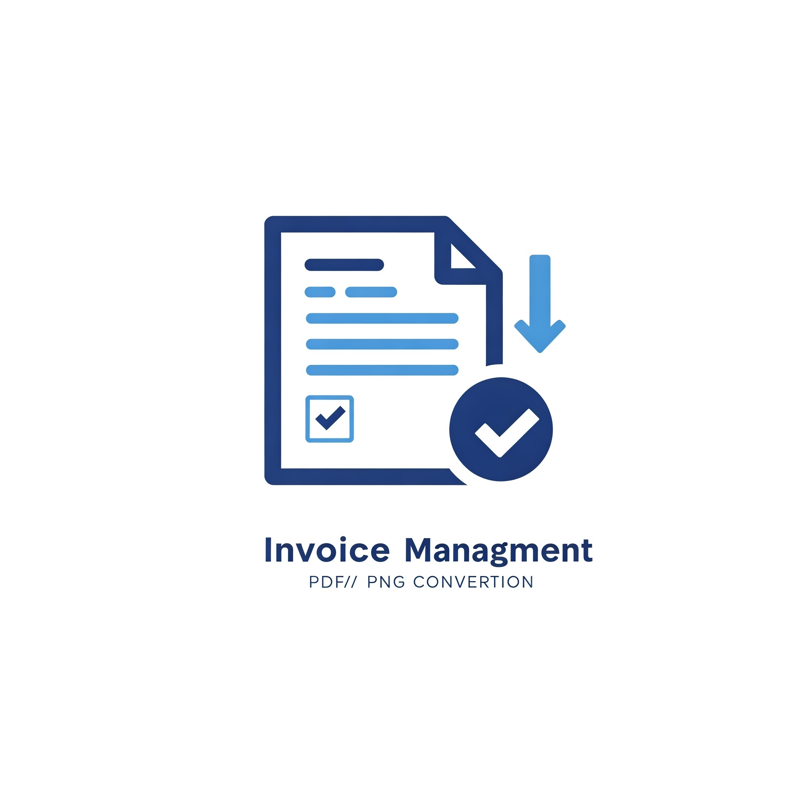
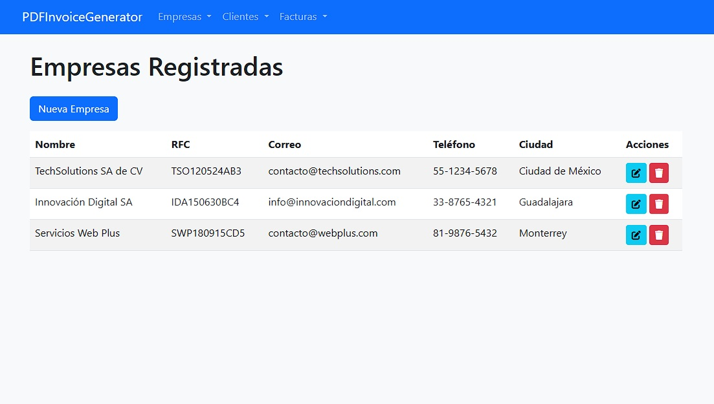
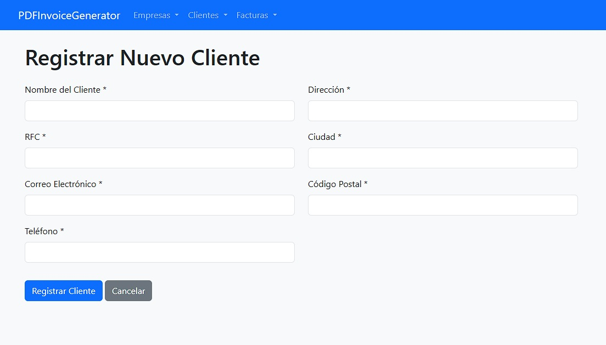
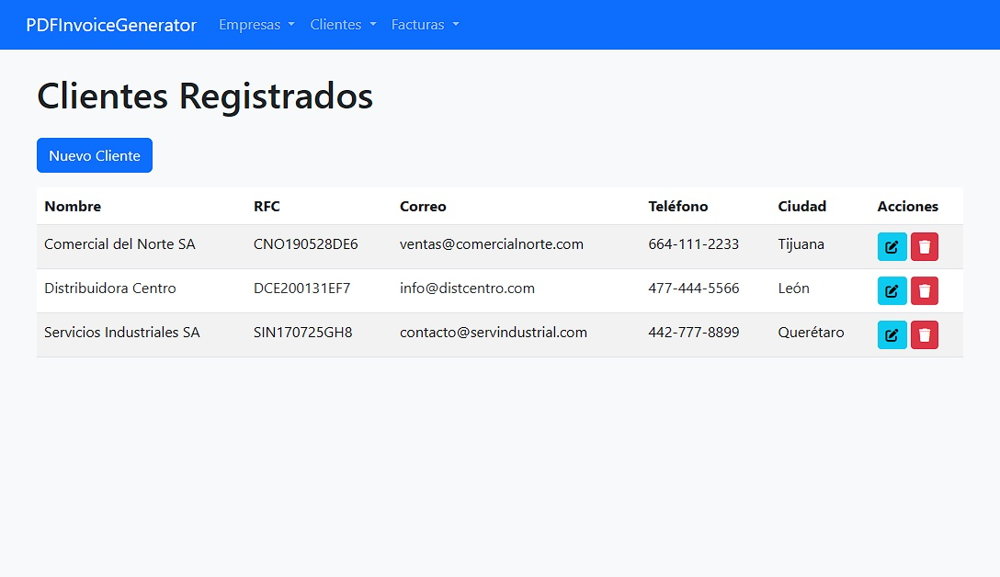
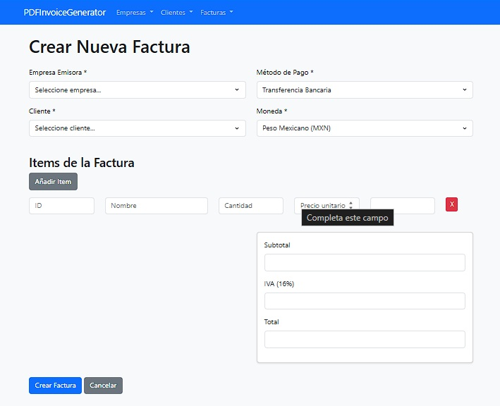
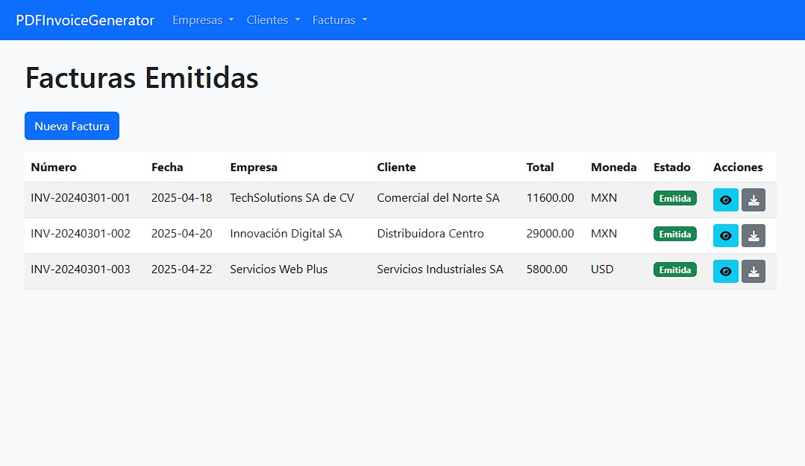
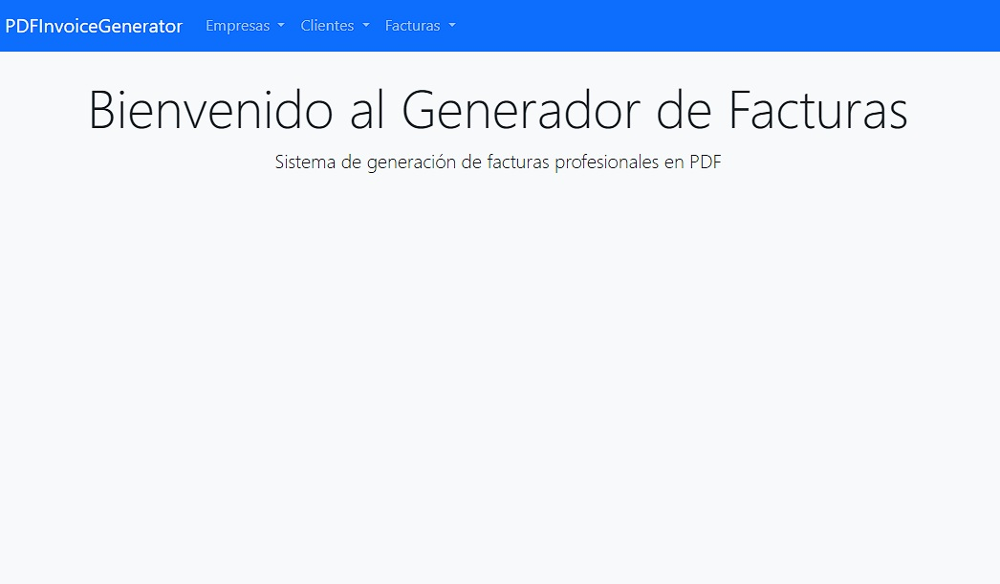
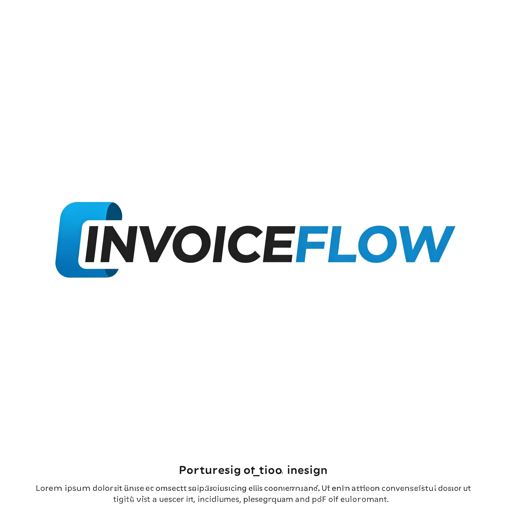

# PDFInvoiceGenerator
Flexible PDF INVOICE generator minimalist web interface, perfect for entrepreneurs looking for effectiveness!

{weigt 100 heigth 100}
{weigt 10% heigth 10%}
{weigt 10% heigth 10%}
{weigt 10% heigth 10%}
{weigt 10% heigth 10%}
{weigt 10% heigth 10%}
{weigt 10% heigth 10%}
{weigt 10% heigth 10%}

## 🛠️ **Tecnologías utilizadas**

Para el desarrollo de **AI Assistant**, se han empleado las siguientes herramientas y frameworks:

- **Flask:** Framework de Python para el desarrollo web backend.
- **WeasyPrint:** Para generar documentos PDF de alta calidad para las facturas.
- **Bootstrap 5:** Diseño moderno, responsivo y estéticamente agradable.
- **SQLAlchemy:** Para manejar la base de datos si se requiere persistencia de datos (facturas, clientes, empresas, etc.).
- **Conversiones en tiempo real:** APIs de conversión de divisas para mantener actualizados los valores de BTC, DOGE y ETH frente al USD.

El sistema permite:
- Generar facturas automáticas con información detallada de empresas, clientes y productos/servicios.
- Manejar múltiples monedas con conversiones en tiempo real (USD, MXN, BTC, DOGE y ETH).
- Administrar métodos de pago flexibles, incluyendo transferencia, tarjeta de crédito, criptomonedas y efectivo.
- Ofrecer una plantilla universal para facturas, con datos claros y diseño llamativo.
- Guardar facturas en una base de datos y listar todas las generadas anteriormente.

### **Características clave**
1. **Datos empresariales y del cliente:**
   - **RFC:** Formato ejemplo: XAXX010101000.
   - **Teléfono:** Formato ejemplo: +52 55 1234 5678.
   - **Código Postal:** Formato ejemplo: 12345.

2. **Detalles del producto/servicio:**
   - **Unidades.**
   - **Identificador interno.**
   - **Nombre y descripción (máximo 20 palabras).**

3. **Número único de factura:**
   - Generado automáticamente con la fecha y hora de emisión, seguido por 4 dígitos únicos. Ejemplo: `20250421-1330-1234`.

4. **Impuestos y métodos de pago:**
   - Solo **IVA** incluido en las facturas.
   - Métodos de pago: Transferencia, tarjeta de crédito, BTC, DOGE, ETH y efectivo.

5. **Manejo de imágenes:**
   - Las imágenes (como el logo de la empresa) se almacenan en el sistema de archivos del servidor.

---

## 🎨 **Diseño de la factura**
- La plantilla de factura será colorida y profesional, destacando los datos importantes.
- Ejemplo de diseño:
  - Encabezado: Logo de la empresa, información de contacto y RFC.
  - Cuerpo: Detalles del cliente, lista de productos/servicios, subtotal, IVA, total.
  - Pie de página: Número de factura, método de pago y fecha de emisión.

---
